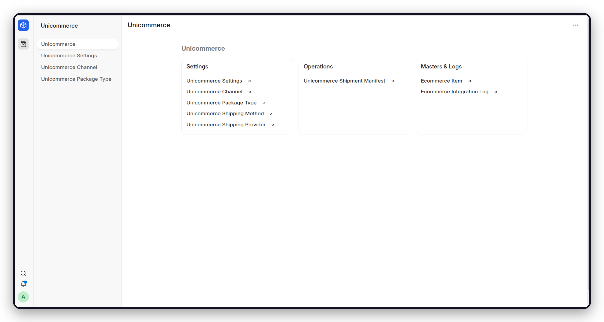
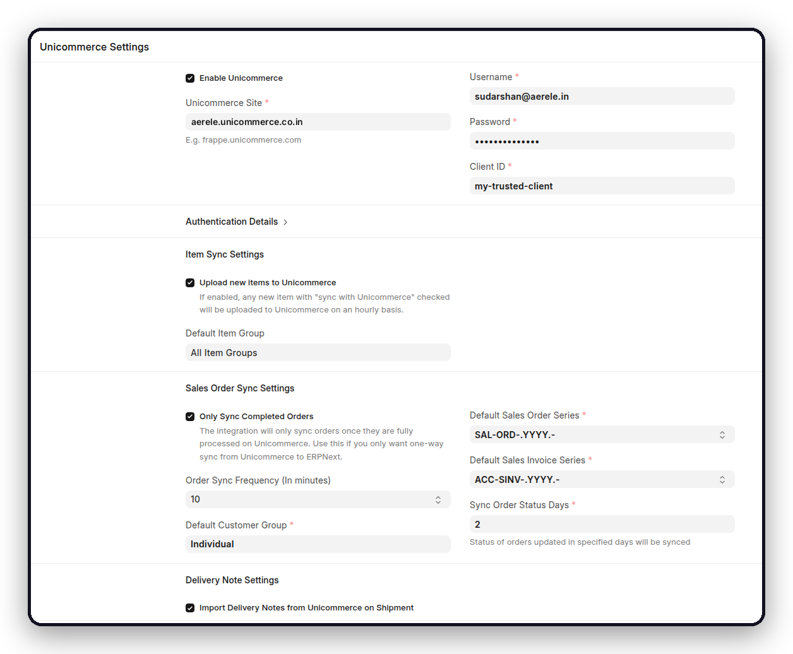
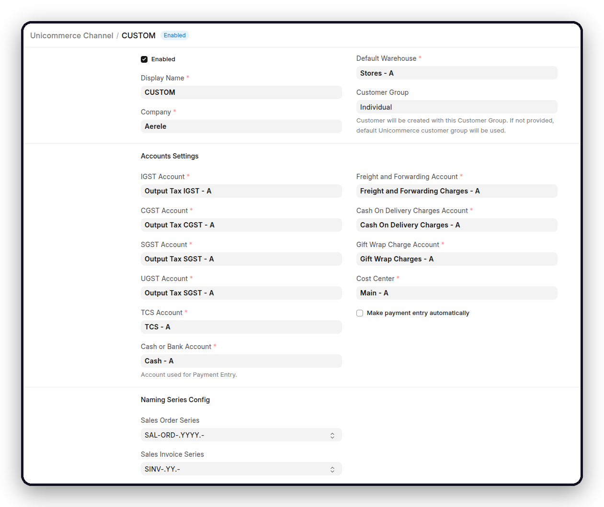

<div align="center">
    <a href="https://github.com/aerele/unicommerce">
	
    </a>
    <h2>Unicommerce for ERPNext</h2>
    <div align="center">
        <p>Sell across every marketplace. Run the back office in ERPNext.</p>
    </div>

[](https://github.com/aerele/unicommerce/actions/workflows/ci.yml)
[](https://github.com/aerele/unicommerce/actions/workflows/linters.yml)
[](license.txt)

</div>

<div align="center">
	
</div>

<div align="center">
	<a href="https://integrations.frappe.cloud/integrations/ecommerce-integration/unicommerce/overview">Documentation</a>
	-
	<a href="https://github.com/aerele/unicommerce/issues">Report a Bug</a>
	-
	<a href="https://github.com/aerele/unicommerce/pulls">Contribute</a>
</div>

## Unicommerce

A standalone integration that connects ERPNext with Unicommerce Uniware.

### Motivation

[Unicommerce Uniware](https://unicommerce.com/) is a multichannel order and
inventory platform, giving sellers a single console for every marketplace they
sell on, their own storefront, and the warehouses that serve them. Running it
alongside ERPNext means the same catalogue, inventory, and orders are maintained
in two places.

Unicommerce for ERPNext removes that duplication. It brings catalogue, inventory,
order, invoice, fulfillment, cancellation, and return workflows into ERPNext, and
publishes catalogue and stock updates back to every connected channel.
Unicommerce identifiers are preserved on the relevant transactions, so records in
both systems remain traceable to one another.

### Key Features

| Workflow | Direction | What the app does |
| --- | --- | --- |
| Item catalogue | ERPNext → Unicommerce | Uploads selected Items as SKUs and updates existing ones. Items missing during an order import are created in ERPNext. |
| Inventory | ERPNext → Unicommerce | Pushes whole-number stock from mapped Warehouses to Unicommerce facilities. |
| Sales orders | Unicommerce → ERPNext | Imports new and date-range historical orders from enabled channels, creating the customers and items they need. |
| Invoices and fulfillment | Two-way | Imports completed invoices, or generates invoices and shipping labels from ERPNext. |
| Delivery notes | Unicommerce → ERPNext | Optionally creates Delivery Notes when shipments are processed. |
| Status, cancellations, returns | Unicommerce → ERPNext | Updates order and package status, handles full and partial cancellations, and drafts Credit Notes for RTO and customer returns. |
| Shipment manifests | ERPNext → Unicommerce | Creates and closes manifests, marks packages dispatched, and attaches the manifest PDF. |
| Goods receipt (GRN) | ERPNext → Unicommerce | Optionally uploads Material Transfer Stock Entries through the Auto GRN API, with batch attributes. |

Synchronization runs as background jobs. Every request, failure, and retry is
recorded in Ecommerce Integration Log.

<details open>

<summary>More</summary>
	
	
</details>

### Under the Hood

- [**Frappe Framework**](https://github.com/frappe/frappe): A full-stack web application framework written in Python and JavaScript, providing the database layer, background job queue, and REST API this integration runs on.

- [**ERPNext**](https://github.com/frappe/erpnext): The accounting, stock, and selling modules that Unicommerce orders, invoices, and shipments are written into.

- [**Ecommerce Core**](https://github.com/aerele/ecommerce-core): The shared item mapping, integration log, and inventory utilities used across Aerele's ecommerce integrations.

## Compatibility

| Component | Version |
| --- | --- |
| Python | 3.14 |
| Frappe Framework | v16 to v17 (`develop`) |
| ERPNext | v16 to v17 (`develop`) |
| Ecommerce Core | `develop` |

## Installation

From an existing bench with Frappe Framework and ERPNext:

```bash
bench get-app ecommerce_core https://github.com/aerele/ecommerce-core.git --branch develop
bench get-app unicommerce https://github.com/aerele/unicommerce.git --branch develop

bench --site <site-name> install-app ecommerce_core
bench --site <site-name> install-app unicommerce
```

Install `ecommerce_core` first, as `unicommerce` depends on it.

## Setup

Complete the ERPNext setup wizard and confirm that the scheduler and background
workers are running, then work through the Unicommerce workspace in order.

**1. Connect**

In **Unicommerce Settings**, select **Enable Unicommerce** and enter your
Unicommerce site hostname without `https://`, along with your username, password,
and client ID. Set the default Customer Group and the Sales Order and Sales
Invoice naming series, then save. The access token, refresh token, and expiry are
populated on a successful connection. If they are not, verify the credentials and
ask Unicommerce whether your server IP requires allowlisting.

**2. Map warehouses**

Add one **Warehouse Mapping** row per Unicommerce facility, mapping the facility
code to an ERPNext Warehouse and setting the Return Warehouse used for credit
notes along with the Company and Dispatch Addresses. Mappings must be one to one.
Quantities are sent as whole numbers to the `DEFAULT` shelf.

**3. Add channels**

Create a **Unicommerce Channel** for each channel ID you want to import, with its
Company, Warehouse, Customer Group, Cost Center, tax and charge accounts, payment
settings, and naming series. Only enabled channels are imported, so enable a
channel once its accounting defaults are complete.

**4. Enable the workflows you need**

| To do this | Enable |
| --- | --- |
| Upload items | **Upload new items to Unicommerce**, a Default Item Group, and **Sync Item with Unicommerce** on each Item |
| Push stock | **Inventory sync**, with a frequency and enabled warehouse mappings |
| Let Unicommerce fulfill | **Only Sync Completed Orders** |
| Fulfill from ERPNext | **Only Sync Completed Orders** left disabled, so orders arrive unbilled. Invoices and labels are then generated from a Sales Order or Pick List, and dispatched on a Shipment Manifest. |
| Import Delivery Notes | **Import Delivery Notes from Unicommerce on Shipment** |
| Upload GRNs | **Use Stock Entry for GRN**, the vendor code, and each batch group's attributes |

Field mappings and illustrated workflows are documented in the
[integration guide](https://integrations.frappe.cloud/integrations/ecommerce-integration/unicommerce/overview).

## Operations

- **Last Order Sync** and **Last Inventory Sync** in Unicommerce Settings confirm that the scheduler is active.
- **Ecommerce Integration Log** holds request payloads, failures, and retries.
- Orders, inventory, and delivery notes are checked every five minutes. Item uploads and status updates run hourly. Both the scheduler and the long worker queue must be running.
- Do not change an ERPNext Item Code once it has been mapped, as Unicommerce SKU codes are immutable.

## Development

```bash
bench --site <site-name> set-config developer_mode 1
bench --site <site-name> migrate
bench --site <site-name> run-tests --app unicommerce
```

Run the repository checks before opening a pull request:

```bash
cd apps/unicommerce
pre-commit install
pre-commit run --all-files
```

## Contributing

Issues and pull requests are welcome. Please keep pull requests focused, add
tests for changed behaviour, and target the `develop` branch.

- [Report a Bug or Request a Feature](https://github.com/aerele/unicommerce/issues)
- [Open a Pull Request](https://github.com/aerele/unicommerce/pulls)

## License

[GNU General Public License v3.0](license.txt)

<br>
<br>
<div align="center">
	<a href="https://aerele.in">
		<picture>
			<source media="(prefers-color-scheme: dark)" srcset="./unicommerce/public/images/aerele-dark.png">
			
		</picture>
	</a>
</div>
